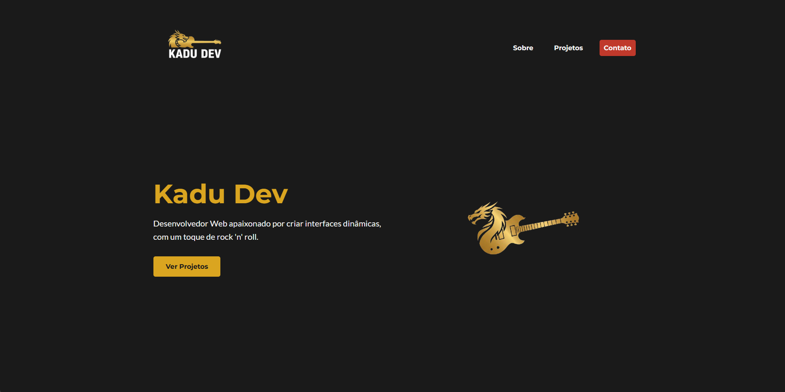

# Meu Portfólio Pessoal 🤘



Este é o repositório do meu portfólio pessoal, desenvolvido para apresentar minhas habilidades, projetos e informações de contato. O projeto foi construído do zero, com foco em código limpo, design responsivo e uma identidade visual coesa que reflete minha personalidade.

**[➡️ Acesse a demonstração ao vivo aqui!](https://kadudev.com)**

---

## ✨ Funcionalidades Principais

-   **Design Responsivo:** Interface totalmente adaptada para uma ótima experiência em desktops, tablets e celulares.
-   **Identidade Visual Única:** Logo e paleta de cores (preto, dourado e vermelho) aplicados de forma consistente.
-   **Seções Claras e Objetivas:**
    -   **Home:** Apresentação inicial impactante.
    -   **Sobre:** Uma introdução sobre mim e minhas habilidades técnicas.
    -   **Projetos:** Uma galeria com cards interativos para meus melhores trabalhos.
    -   **Contato:** Links diretos para minhas redes e email.
-   **Ícones Dinâmicos:** Uso das bibliotecas **Devicon** e **Font Awesome** para representar tecnologias e links de forma visual.
-   **Estrutura Modular:** Código CSS organizado em componentes e seções para fácil manutenção, seguindo os princípios de Clean Code.

---

## 🛠️ Tecnologias e Ferramentas Utilizadas

Este projeto foi construído utilizando tecnologias web fundamentais, sem o uso de frameworks JavaScript, para demonstrar uma base sólida em:

-   **HTML5** (Estrutura Semântica)
-   **CSS3**
    -   Flexbox e Grid Layout
    -   Variáveis CSS (Custom Properties)
    -   Media Queries para Responsividade
    -   Animações e Transições sutis
-   **Bibliotecas Externas:**
    -   **Google Fonts** para a tipografia.
    -   **Devicon** para os ícones de tecnologia.
    -   **Font Awesome** para os ícones de interface e links.

---

## 🚀 Como Executar o Projeto Localmente

Por ser um projeto estático, não há necessidade de instalação de dependências.

1.  **Clone o repositório:**
    ```bash
    git clone [https://github.com/KaduSR/Portfolio.git](https://github.com/KaduSR/Portfolio.git)
    ```

2.  **Navegue para a pasta do projeto:**
    ```bash
    cd Portfolio
    ```

3.  **Abra o arquivo `index.html`** no seu navegador de preferência.

---

## ✒️ Autor

Feito com ❤️ por **Kadu Ribeiro**

-   **LinkedIn:** [@kaduesr](https://www.linkedin.com/in/kaduesr/)
-   **GitHub:** [@KaduSR](https://github.com/KaduSR)
